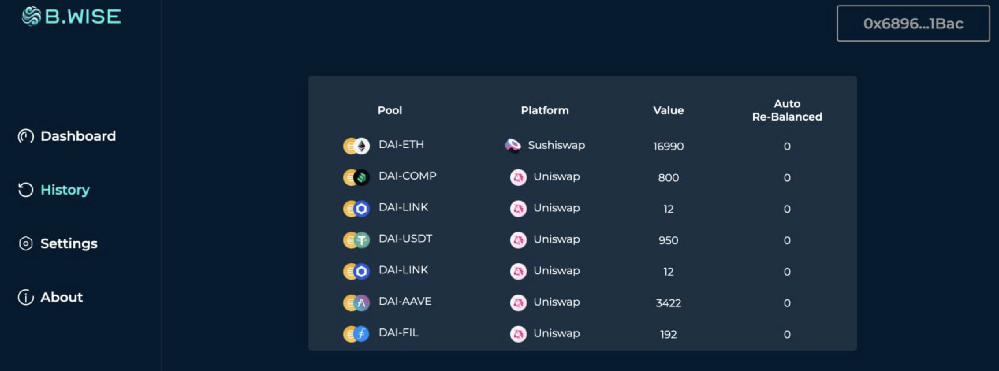

# B.Wise

## Introduction

`Having non-correlated source of risk, so the movement at least do not correspond one-to-one, is better than having just one source of risk.`  -  ETHGlobalOnline 2023.

Why does banks exist ? It’s because they offer multiple financial services. They keep money for savers but also can be lenders. What is BWise providing is similar to banking.

BWise is in the same time, making sure that your money is not going out of range of uniswap pools and thus, you are not been victim of impermanent loss but it is also using that extra amount of tokens that is recalibrated and not used anymore as a lending share, thus enabling you to earn yield thanks to SPARK technology with a stable coin.





# Description 

To reduce fragmentation of Liquidity we have chosen to use SPARK technology by choosing DAI as a bridge currency. Every trade in our Auto-Rebalancing mechanism will include DAI/ABC pair. 
DAI is stable coin and participates naturally into reducing Impermanent loss.


# Tehcnical Architecture 


Contracts are deployed on Scroll using Foundry :

Example of verification : 

``` // Verify SavingsDai forge verify-contract
  --num-of-optimizations 10 /
  --watch /
  --constructor-args $(cast abi-encode "constructor(address, address)" 0x9BfCdf238d9Ad87e526d166020990F1a22c9708F 0x3F9696ADb8cB545a8D58015550E9E4190b4665F6) /
  --verifier etherscan / 
  --verifier-url https://api-sepolia.scrollscan.dev/api / 
  --etherscan-api-key D62920783A4311EE9D6600155D570C742E / 
  --compiler-version v0.8.20 / 
  0xD46073c9118890eeaAF804Ff0EA9615fe4701b7d / 
  SavingsDai /
``` 


# Technology used 

#### TableLand

    - Our implementation include a TableLand server allowing creation/insert data into our database.
    - POC : [https://sepolia.etherscan.io/tx/0xf3ae75b0ada09e0212833cbaedb199d9676ba41669320e18338fd884130b870d](Insert)
    - Database : ```{"name":"bwise_11155111_200","externalUrl":"https://testnets.tableland.network/api/v1/tables/11155111/200","animationUrl":"https://tables.testnets.tableland.xyz/11155111/200.html","image":"https://tables.testnets.tableland.xyz/11155111/200.svg","schema":{"columns":[{"name":"TokenA","type":"text"},{"name":"TokenB","type":"text"},{"name":"Platform","type":"text"},{"name":"Value","type":"integer"},{"name":"AutoRebalance","type":"integer"}]},"attributes":[{"displayType":"date","traitType":"created","value":1697641468}]}```

#### Scroll :
- [https://sepolia.scrollscan.com/address/0x800966bb8F19765B281b158a88590e304194E31F](VAT)
- [https://sepolia.scrollscan.com/address/0x3F9696ADb8cB545a8D58015550E9E4190b4665F6#code](POT)
- [https://sepolia.scrollscan.com/address/0x9BfCdf238d9Ad87e526d166020990F1a22c9708F#code](DAIJOIN)
- [https://sepolia.scrollscan.com/address/0xD46073c9118890eeaAF804Ff0EA9615fe4701b7d](SavingsDai) 


#### Chainlink

#### Spark implementation :
    - we have modified savingsDai contract to have a getLiquidityPosition that allows us to monitor DAI position in the monitor contract. 
    - Spark contract are also deployed to Scroll (see #Scroll section) 


# Contact 


